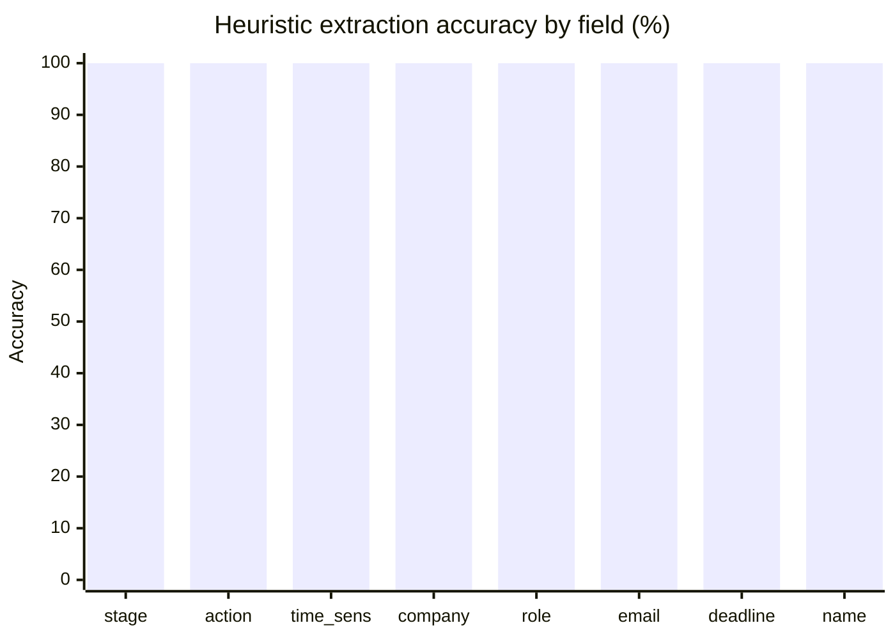
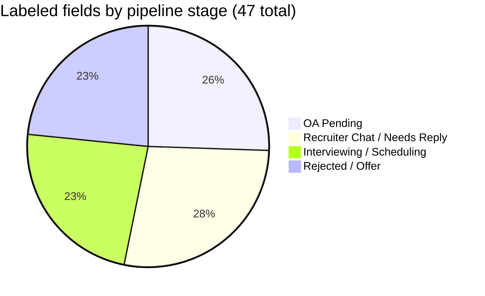

# Recruiting OS

**An AI-powered opportunity pipeline for students**

Recruiting OS helps students manage the end-to-end recruiting process by converting scattered recruiting-related information into a structured opportunity pipeline.

Students get recruiting information from everywhere: Gmail, LinkedIn, job postings, OAs, interview scheduling, follow-ups, rejections, offers. This app ingests those messages, extracts structured data, classifies pipeline stage, generates next actions and draft replies, and surfaces what matters **today**.

## Tech stack

- **Next.js** (App Router) + **React** + **TypeScript**
- **Tailwind CSS**
- **Supabase** (Postgres + Auth + RLS)
- **Ollama Cloud** (Mistral `ministral-3:3b`) for message extraction
- **Heuristic fallback** when Ollama is unavailable

## Features

- **Intake**: paste a message → Ollama extraction → review → save to pipeline
- **Gmail**: connect, scan inbox, preview, import selected (read-only OAuth)
- **Discover**: browse public job boards, import to pipeline (no LLM)
- **Pipeline**: kanban by stage, drag cards between columns, stage dropdown per card
- **Today**: prioritized pending actions + dynamic **Needs your reply** section
- **Calendar**: month grid (indigo = Recruiting OS, gray = Google), schedule recruiter calls, Google sync, `.ics` export
- **Dedup**: fuzzy company/role + shared apply URL matching; merge duplicates; auto-link Gmail/Discover imports
- **Priority**: scores on a **1-10** scale (higher = more urgent on Today and pipeline sort)
- **Auth**: Supabase email/password, per-user RLS
- **Drafts**: Ollama (Mistral) reply / follow-up / scheduling with template fallback
- **Account & draft context**: per-user resume upload (PDF / text) and highlight bullets for AI drafts
- **Demo seed data**: load from Home (`Load Demo Data`) or `POST /api/seed` while signed in

## Prerequisites

- Node.js 20+
- npm
- A [Supabase](https://supabase.com) project (free tier is fine)

## Local setup

### 1. Clone and install

```bash
git clone https://github.com/Arunima-Srivastav/recruitingos.git
cd recruitingos
npm install
```

### 2. Configure environment variables

**macOS / Linux:**

```bash
cp .env.example .env.local
```

**Windows (PowerShell or CMD):**

```powershell
copy .env.example .env.local
```

| Variable | Required | Description |
|----------|----------|-------------|
| `NEXT_PUBLIC_SUPABASE_URL` | Yes | Supabase project URL |
| `NEXT_PUBLIC_SUPABASE_ANON_KEY` | Yes | Supabase anon/public key |
| `OLLAMA_API_KEY` | No | Ollama Cloud API key ([ollama.com](https://ollama.com) → Settings → Keys) |
| `OLLAMA_BASE_URL` | No | Default `https://ollama.com` |
| `OLLAMA_MODEL` | No | Mistral-family override only (default `ministral-3:3b`; Gemma ignored) |
| `GOOGLE_CLIENT_ID` | For Gmail/Calendar | Google OAuth client ID |
| `GOOGLE_CLIENT_SECRET` | For Gmail/Calendar | Google OAuth client secret |
| `GOOGLE_REDIRECT_URI` | For Gmail/Calendar | e.g. `http://localhost:3000/api/auth/google/callback` |
| `NEXT_PUBLIC_APP_URL` | For Gmail/Calendar | e.g. `http://localhost:3000` |

### 3. Database and auth

1. **Authentication → Providers**: enable **Email** (disable email confirmation for local dev if you want instant sign-in).
2. **Authentication → URL configuration**: add `http://localhost:3000/**` to redirect URLs for local dev.
3. **SQL Editor** — run both scripts below for a **new** project:

| Script | Required for | Purpose |
|--------|--------------|---------|
| [`supabase/schema.sql`](supabase/schema.sql) | Everyone | Core tables, Gmail fields, RLS, calendar sync |
| [`supabase/migrations/006_user_draft_context.sql`](supabase/migrations/006_user_draft_context.sql) | Account / resume / AI drafts | `user_draft_context` table |

[`schema.sql`](supabase/schema.sql) is the consolidated baseline for new installs (it already includes what migrations `002`–`005` added historically). Migration **`006` is still required** on fresh projects — resume and highlight storage is not in `schema.sql`.

**Upgrading an older database** (created before those pieces existed): run any missing migrations **in order**:

| Migration | Purpose | Already in `schema.sql`? |
|-----------|---------|--------------------------|
| [`002_gmail.sql`](supabase/migrations/002_gmail.sql) | Gmail fields on messages | Yes |
| [`003_auth_rls.sql`](supabase/migrations/003_auth_rls.sql) | Per-user RLS | Yes |
| [`004_calendar_sync.sql`](supabase/migrations/004_calendar_sync.sql) | Calendar sync links | Yes |
| [`005_user_calendar_events.sql`](supabase/migrations/005_user_calendar_events.sql) | Custom calendar events | Yes |
| [`006_user_draft_context.sql`](supabase/migrations/006_user_draft_context.sql) | Resume and highlights for AI drafts | **No — run this** |

**Note:** Data under the old `demo-user` id will not appear after you sign in with a real account.

### 4. Run the app

```bash
npm run dev
```

Open [http://localhost:3000](http://localhost:3000), sign in, then use Pipeline, Intake, Gmail, Discover, Today, and Calendar.

### 5. Testing and evaluation

Recruiting OS has **automated unit tests**, an **extraction accuracy harness** with labeled fixtures, and a **manual smoke-test checklist** for full-stack verification. Nothing in the automated suite requires a live Supabase, Ollama, or Google account.

#### Commands

| Command | What it runs | External services |
|---------|--------------|-------------------|
| `npm test` | All unit tests + extraction regression (62 tests) | None |
| `npm run eval:extract` | Heuristic parser accuracy report on labeled fixtures | None |
| `npm run eval:extract:ollama` | Same report using live Ollama (`ministral-3:3b`) | `OLLAMA_API_KEY` |
| `npm run lint` | ESLint | None |
| `npm run build` | Production Next.js build (TypeScript check) | None |
| `npm start` | Serve production build locally | Supabase if pages hit DB |

**Pre-release checklist** (run from project root):

```bash
npm test
npm run eval:extract
npm run lint
npm run build
```

Then start the app (`npm run dev`), sign in, and walk through the [manual smoke test](#manual-smoke-test) below.

**Continuous integration:** There is no GitHub Actions workflow checked in yet. Tests run locally via `npm test`. To add CI, run the [pre-release checklist](#5-testing-and-evaluation) on every push — for example:

```yaml
# .github/workflows/test.yml (example)
jobs:
  test:
    runs-on: ubuntu-latest
    steps:
      - uses: actions/checkout@v4
      - uses: actions/setup-node@v4
        with: { node-version: "20" }
      - run: npm ci
      - run: npm test
      - run: npm run eval:extract
      - run: npm run lint
      - run: npm run build
```

Ollama eval (`eval:extract:ollama`) is optional in CI — it needs a secret `OLLAMA_API_KEY` and calls a live API.

#### Unit test coverage

`npm test` runs **62 tests** across **30 suites** (`src/lib/**/*.test.ts`). All tests are offline — no network, database, or API keys.

| Module | File(s) | What is tested |
|--------|---------|----------------|
| **Dedup — match** | `dedup/match.test.ts` | Company/role/URL duplicate detection, import linking |
| **Dedup — merge** | `dedup/merge.test.ts` | Stage/deadline/source merge rules when combining cards |
| **Dedup — normalize** | `dedup/normalize.test.ts` | Company/role normalization and fuzzy matching |
| **Dedup — URLs** | `dedup/urls.test.ts` | Apply URL extraction, normalization, overlap |
| **Priority** | `prioritizer.test.ts` | 1–10 scoring, inactive stage cap, legacy score migration |
| **Needs reply** | `replies/detect.test.ts` | Reply detection for Today / home |
| **Calendar** | `calendar/pipeline.test.ts` | Stage/company guessing from Google event titles |
| **Drafts** | `ai/draft.test.ts` | Draft body sanitization (strip code fences) |
| **Draft context** | `draftContext.test.ts` | Resume/highlight trimming for prompts |
| **Resume parsing** | `resume/parseResumeFile.test.ts` | PDF/text upload parsing, extension checks |
| **Extraction eval** | `evaluation/extraction.eval.test.ts` | Heuristic meets ≥75% accuracy on fixtures |
| **Extraction scoring** | `evaluation/score.test.ts` | Fixture scorer: fuzzy match, unlabeled fields |

#### Extraction evaluation

Message extraction is the core AI/heuristic feature: turn raw recruiting email or LinkedIn text into structured pipeline data (company, role, stage, next action, etc.). The evaluation harness measures how often extraction output matches **human-labeled ground truth**.

**Code location:** [`src/lib/evaluation/`](src/lib/evaluation/)

| File | Purpose |
|------|---------|
| [`fixtures/recruiting-messages.json`](src/lib/evaluation/fixtures/recruiting-messages.json) | Labeled message corpus (8 fixtures) |
| [`score.ts`](src/lib/evaluation/score.ts) | Field-by-field scoring and report formatting |
| [`extraction.eval.test.ts`](src/lib/evaluation/extraction.eval.test.ts) | CI regression gate (≥75% heuristic accuracy) |
| [`scripts/eval-extract.ts`](scripts/eval-extract.ts) | CLI report (`npm run eval:extract`) |

##### What the fixtures are

Each fixture is a realistic recruiting message with:

- **`id`** — stable identifier
- **`description`** — what scenario it represents
- **`sourceType`** — optional channel hint (`gmail`, `linkedin`) passed to the extractor
- **`rawText`** — the full message body (same format a student would paste or import)
- **`expected`** — ground-truth labels for fields we care about

Fixtures are derived from common student recruiting scenarios: recruiter outreach, OA deadlines, post-interview waiting, rejections, final-round scheduling, cold LinkedIn interest checks, offer letters, and third-party assessment platforms (HackerRank, CodeSignal). Five fixtures overlap with the demo seed messages in [`src/app/api/seed/route.ts`](src/app/api/seed/route.ts); three were added for edge cases (Needs Reply, Offer, CodeSignal).

**Not every field is labeled on every fixture** — only include fields where the correct answer is unambiguous. Unlabeled fields are skipped during scoring.

##### Fixture catalog

| ID | Source | Scenario | Pipeline stage | Labeled fields |
|----|--------|----------|----------------|----------------|
| `databricks-recruiter` | LinkedIn | Recruiter asks to schedule a call | Recruiter Chat | company, role, stage, action, email, name, time-sensitive |
| `stripe-oa` | Gmail | HackerRank OA with deadline | OA Pending | company, role, stage, action, email, deadline, time-sensitive |
| `google-waiting` | Gmail | Post-interview “still deciding” | Interviewing | company, role, stage, action, time-sensitive |
| `meta-rejected` | Gmail | Rejection after interviews | Rejected | role, stage, action, time-sensitive |
| `anthropic-final` | Gmail | “Congratulations” + schedule final round | Interview Scheduling | company, role, stage, action, email, time-sensitive |
| `needs-reply-interest` | LinkedIn | “Would you be interested?” outreach | Needs Reply | company, role, stage, action, email, time-sensitive |
| `offer-congrats` | Gmail | Offer letter with decision deadline | Offer | company, role, stage, action, email, deadline, time-sensitive |
| `codesignal-oa` | Gmail | CodeSignal assessment with deadline | OA Pending | company, stage, action, deadline, time-sensitive |

##### How scoring works

For each fixture, the harness runs the extractor and compares output to `expected`:

| Field | Match rule |
|-------|------------|
| `company`, `role_title`, `recruiter_email`, `recruiter_name` | Case-insensitive fuzzy substring match (handles `"Stripe"` vs `"stripe"`, `"Software Engineer"` vs `"Software Engineering Intern"`) |
| `stage`, `action_type` | Exact match |
| `has_deadline` | Boolean — was any deadline extracted? (exact date not compared) |
| `is_time_sensitive` | Exact boolean match |

**Metrics reported:**

- **Field accuracy** — `passed fields / total labeled fields` across all fixtures
- **Fixture pass rate** — fixtures where every labeled field matched
- **Regression threshold** — `npm test` fails if heuristic field accuracy drops below **75%** (`HEURISTIC_MIN_ACCURACY` in [`src/lib/evaluation/index.ts`](src/lib/evaluation/index.ts))

##### Results (heuristic parser)

> **Note:** Accuracy tables below reflect a point-in-time run of `npm run eval:extract`. Re-run that command after changing fixtures or [`src/lib/mockExtractor.ts`](src/lib/mockExtractor.ts) and update this section if numbers shift.

Last run: **`npm run eval:extract`** — heuristic fallback parser ([`src/lib/mockExtractor.ts`](src/lib/mockExtractor.ts)), no Ollama.

**Overall**

| Metric | Result |
|--------|--------|
| Field accuracy | **100.0%** (47 / 47 labeled fields) |
| Fixture pass rate | **100%** (8 / 8 fixtures fully correct) |
| Regression threshold | 75% minimum — **pass** |

**Per-fixture results**

| Fixture | Fields scored | Pass |
|---------|---------------|------|
| `databricks-recruiter` | 7 / 7 | ✓ |
| `stripe-oa` | 7 / 7 | ✓ |
| `google-waiting` | 5 / 5 | ✓ |
| `meta-rejected` | 4 / 4 | ✓ |
| `anthropic-final` | 6 / 6 | ✓ |
| `needs-reply-interest` | 6 / 6 | ✓ |
| `offer-congrats` | 7 / 7 | ✓ |
| `codesignal-oa` | 5 / 5 | ✓ |

**Per-field accuracy** (across all fixtures where the field is labeled)

| Field | Times labeled | Heuristic accuracy |
|-------|---------------|-------------------|
| `stage` | 8 | 100% |
| `action_type` | 8 | 100% |
| `is_time_sensitive` | 8 | 100% |
| `company` | 7 | 100% |
| `role_title` | 7 | 100% |
| `recruiter_email` | 5 | 100% |
| `has_deadline` | 3 | 100% |
| `recruiter_name` | 1 | 100% |





##### Ollama (live AI) evaluation

When `OLLAMA_API_KEY` is set, run:

```bash
npm run eval:extract:ollama
```

This uses the same fixtures and scoring but calls [`extractRecruitingMessage`](src/lib/ai/extract.ts) with Mistral (`ministral-3:3b` by default). Results vary by model and API availability — re-run after changing `OLLAMA_MODEL` or prompts. The CLI uses a **50%** minimum threshold for Ollama (vs **75%** for heuristic in CI).

**Recorded Ollama results:** Not benchmarked in-repo (requires `OLLAMA_API_KEY` in `.env.local`). After configuring Ollama, run `npm run eval:extract:ollama` and paste the summary here or in your report. Expect field accuracy to differ from the heuristic baseline — Ollama maps through [AI stages → pipeline stages](#message-extraction-ollama) before scoring.

##### Adding a fixture

1. Add an entry to [`src/lib/evaluation/fixtures/recruiting-messages.json`](src/lib/evaluation/fixtures/recruiting-messages.json).
2. Include only unambiguous `expected` fields.
3. Run `npm run eval:extract` and confirm accuracy.
4. `npm test` picks up the new fixture automatically.

Example:

```json
{
  "id": "my-fixture",
  "description": "Short scenario description",
  "sourceType": "gmail",
  "rawText": "Full message text…",
  "expected": {
    "company": "Acme",
    "stage": "OA Pending",
    "action_type": "oa",
    "has_deadline": true
  }
}
```

#### Manual smoke test

Use this after `npm run dev` with Supabase configured. Optional columns need the listed env vars.

| Step | Page / action | Verify | Requires |
|------|---------------|--------|----------|
| 1 | `/login` | Sign up or sign in | Supabase |
| 2 | `/` → **Load Demo Data** (or `POST /api/seed`) | Demo pipeline populates | Supabase |
| 3 | `/intake` | Paste message → extract → save → card on Pipeline | Supabase; Ollama optional |
| 4 | `/pipeline` | Drag card between columns; change stage dropdown | Supabase |
| 5 | `/today` | Actions and “Needs your reply” appear with priority | Supabase |
| 6 | `/discover` | Browse a board → import → card appears | Supabase + network |
| 7 | `/opportunities/[id]` | View messages, complete action, generate draft | Supabase; Ollama optional for AI draft |
| 8 | `/account` | Upload or paste resume + highlights | Supabase + migration `006` |
| 9 | `/gmail` | Connect → scan → import selected | Google OAuth + Supabase |
| 10 | `/calendar` | View events, sync to Google, export `.ics` | Google OAuth + Calendar API |

**Production build smoke test:**

```bash
npm run build
npm start
```

Open [http://localhost:3000](http://localhost:3000) and repeat sign-in + one intake save to confirm the build serves correctly.

## Core user flow

1. **Home** (`/`): overview, quick links, **Load Demo Data** button
2. **Sign in** (`/login`): email/password
3. **Add Message** (`/intake`): paste → extract → review → save
4. **Gmail** (`/gmail`): connect → scan → import selected
5. **Discover** (`/discover`): browse boards → import selected
6. **Pipeline** (`/pipeline`): kanban; **drag cards** between columns or use the stage dropdown
7. **Today** (`/today`): prioritized actions and reply detection
8. **Calendar** (`/calendar`): deadlines, Google sync, export
9. **Opportunity** (`/opportunities/[id]`): messages, actions, drafts, merge duplicates
10. **Account** (`/account`): sign-out, Gmail shortcut, resume and highlights for drafts

### Demo seed data

The home page **Load Demo Data** button calls `POST /api/seed` (sign-in required). It creates five sample opportunities if the pipeline is empty; a second click returns `"Demo data already exists"`.

From the browser console while signed in:

```javascript
fetch("/api/seed", { method: "POST" }).then((r) => r.json()).then(console.log)
```

Or with curl after copying your session cookie from DevTools → Application → Cookies:

```bash
curl -X POST http://localhost:3000/api/seed -H "Cookie: YOUR_SESSION_COOKIE"
```

## Pipeline stages

Kanban columns and stage dropdowns use these values (in order). Dragging or updating stage recalculates priority.

| Stage | Typical meaning |
|-------|-----------------|
| **New** | First touch, not yet actioned |
| **Recruiter Chat** | Scheduling a recruiter call |
| **Needs Reply** | Waiting on your response |
| **OA Pending** | Online assessment to complete |
| **Interview Scheduling** | Coordinating interview times |
| **Interviewing** | Interviews in progress or completed; waiting on company |
| **Waiting** | Applied or idle; no immediate action |
| **Offer** | Offer received |
| **Rejected** | Closed — rejection |
| **Ghosted** | Closed — no response |

Inactive stages (**Rejected**, **Ghosted**) are pinned to minimum priority (**1/10**). **Offer** is treated as inactive for “needs reply” detection.

## Priority scoring (1-10)

Priority is an integer from **1** (lowest) to **10** (highest). It drives sort order on **Pipeline** and **Today** and appears on cards as `N/10`.

Signals include: deadline urgency, reply/scheduling/OA needs, active stages (Recruiter Chat, Interviewing), Gmail source, and recency. Inactive stages (Rejected, Ghosted) are pinned to **1**.

Older rows saved before the 1-10 scale may still have larger numbers in the database; the UI normalizes those on display (legacy values are divided by 10). New saves and imports always store 1-10.

## Duplicate detection

- **Discover**: deduped by `discover:{sourceId}:{nativeId}`; also fuzzy match on company + role or shared apply URL before creating a new card
- **Gmail**: same fuzzy linking when company/role matches an existing opportunity
- **Manual intake**: always creates a new opportunity; API returns `possible_duplicates` for review
- **Opportunity detail**: banner to view or **merge** duplicates (messages and actions combined)

## Discover job boards

| Source | Type | Notes |
|--------|------|-------|
| Simplify · Summer 2026 Internships | Internships | GitHub `listings.json` |
| Simplify · New Grad Positions | New grad | GitHub `listings.json` |
| Greenhouse · Target Companies | General | Stripe, Figma, Databricks, and more |
| Himalayas · Remote Jobs | Remote | [Himalayas API](https://himalayas.app/jobs/api) |
| Jobicy · Remote Jobs | Remote | [Jobicy API](https://jobi.cy/apidocs) (attribution required) |
| Remotive · Remote Jobs | Remote | Public API |
| Arbeitnow · Job Board | General tech | Tech-filtered listings |

Imports map API fields directly (no LLM). Add adapters in `src/lib/discover/sources/` and register in `sources/index.ts`.

### Job board attribution

Some Discover sources require attribution. When a source defines an `attribution` object, the Discover page shows a footer while that source is selected:

> Job listings courtesy of **Jobicy**. Apply on their site.

| Source | Attribution link | Where it appears |
|--------|------------------|------------------|
| **Jobicy** | [jobicy.com](https://jobicy.com/) | Footer on `/discover` when Jobicy is the active source ([`src/lib/discover/sources/jobicy.ts`](src/lib/discover/sources/jobicy.ts)) |
| **Himalayas** | [himalayas.app](https://himalayas.app/) | Same footer pattern when Himalayas is selected |

Listings still import into your pipeline; apply links point to the external board. To add attribution for a new adapter, set `attribution: { label, href }` on the `DiscoverSource` in `src/lib/discover/sources/`.

## Calendar and Google sync

- **Indigo**: Recruiting OS (pipeline deadlines, actions, custom events)
- **Gray**: Google Calendar events not yet in the pipeline
- **Scheduling panel**: Recruiter Chat, Interview Scheduling, and related actions (not full pipeline/OA)
- **Remove from calendar**: clears local date and removes from Google when synced
- **Add to pipeline**: import a gray Google event as an opportunity + action

Enable **Google Calendar API** on the same OAuth client as Gmail. Connect from the Calendar page, then **Sync to Google Calendar**.

## API routes (main)

| Route | Method | Purpose |
|-------|--------|---------|
| `/api/ai/extract-message` | POST | Ollama/heuristic extraction |
| `/api/intake` | POST | Save reviewed opportunity |
| `/api/seed` | POST | Demo data (also triggered by Home → Load Demo Data) |
| `/api/drafts/generate` | POST | AI drafts (Ollama Mistral) with template fallback |
| `/api/account/draft-context` | GET, PUT | Resume and highlights for draft generation |
| `/api/account/draft-context/upload` | POST | Parse PDF / text resume upload |
| `/api/opportunities/update-stage` | POST | Change stage |
| `/api/opportunities/duplicates` | GET | List possible duplicates |
| `/api/opportunities/merge` | POST | Merge two opportunities |
| `/api/opportunities/delete` | POST | Delete opportunity |
| `/api/actions/complete` | POST | Complete action |
| `/api/replies` | GET | Needs-reply items for Today/home |
| `/api/auth/google/start` | GET | Begin Google OAuth (Gmail / Calendar); redirects to Google |
| `/api/auth/google/callback` | GET | OAuth callback; stores tokens in `google_connections` |
| `/api/gmail/status` | GET | Connection status |
| `/api/gmail/scan` | POST | Scan inbox for recruiting messages |
| `/api/gmail/import` | POST | Import selected messages |
| `/api/gmail/disconnect` | POST | Revoke local Google connection |
| `/api/discover/sources` | GET | List job board sources |
| `/api/discover/listings` | GET | Paginated listings for a source |
| `/api/discover/import` | POST | Import listing to pipeline |
| `/api/calendar/events` | GET | Calendar events (pipeline + Google) |
| `/api/calendar/export` | GET | Download `.ics` |
| `/api/calendar/sync` | POST | Push events to Google Calendar |
| `/api/calendar/schedule` | POST | Schedule recruiter call / interview |
| `/api/calendar/status` | GET | Google Calendar connection status |
| `/api/calendar/remove` | POST | Remove event from calendar / Google |
| `/api/calendar/import-to-pipeline` | POST | Import gray Google event as opportunity |

Protected pages (`/pipeline`, `/intake`, `/gmail`, etc.) require Supabase auth via [`src/middleware.ts`](src/middleware.ts). API routes call `requireUser()` and rely on RLS for row isolation.

## Data model

Postgres tables in Supabase (see [`supabase/schema.sql`](supabase/schema.sql) and migrations):

| Table | Purpose | Key fields |
|-------|---------|------------|
| `opportunities` | Pipeline cards | `company`, `role_title`, `stage`, `priority_score`, `deadline`, `next_action`, `source`, `user_id` |
| `messages` | Raw + extracted message bodies | `body`, `extracted_json`, `external_message_id`, `extraction_status`, `needs_review`, `opportunity_id` |
| `actions` | To-dos surfaced on Today | `action_type`, `title`, `due_at`, `status`, `priority_score`, `opportunity_id` |
| `drafts` | Generated reply / follow-up / scheduling text | `draft_type`, `tone`, `body`, `opportunity_id` |
| `google_connections` | OAuth tokens per user | `access_token`, `refresh_token`, `google_email`, `calendar_sync_enabled` |
| `calendar_event_links` | Maps pipeline items → Google event IDs | `source_kind`, `source_id`, `google_event_id` |
| `user_calendar_events` | Custom all-day / timed events | `title`, `starts_at`, `ends_at`, `opportunity_id` |
| `user_draft_context` | Resume + highlights for AI drafts (migration `006`) | `resume_text`, `highlights_text`, `resume_filename`, `user_id` |

All user-owned rows use `user_id` matching `auth.uid()` with **row-level security** policies.

## Project structure

```
src/
  app/                 # Pages and API routes
  components/          # UI (pipeline, calendar, discover, etc.)
  lib/
    ai/                # Ollama client, extraction prompts
    dedup/             # Match, merge, import linking
    discover/          # Job board adapters
    calendar/          # Events, Google sync
    evaluation/        # Extraction fixtures + accuracy harness
    replies/           # Needs-reply detection
    prioritizer.ts     # 1-10 priority scoring
    db.ts              # Supabase access (requireUser + RLS)
scripts/
  eval-extract.ts      # CLI extraction accuracy report
supabase/
  schema.sql
  migrations/
```

## Ollama setup

1. Sign in at [ollama.com](https://ollama.com) and create an API key.
2. Add to `.env.local`:

```env
OLLAMA_API_KEY=your-key-here
OLLAMA_BASE_URL=https://ollama.com
OLLAMA_MODEL=ministral-3:3b
```

3. Restart `npm run dev`.

Without `OLLAMA_API_KEY`, intake and Gmail import use the heuristic parser.

### Message extraction (Ollama)

When Ollama is configured, [`extractRecruitingMessage`](src/lib/ai/extract.ts) asks Mistral for structured JSON, validates it with Zod, then maps **AI stages** to **pipeline stages** stored on opportunities:

| AI stage (`ai_stage`) | Pipeline stage |
|-----------------------|----------------|
| `sourced`, `saved`, `unknown` | New |
| `applied` | Waiting |
| `recruiter_contact` | Recruiter Chat |
| `oa` | OA Pending |
| `interview`, `final_round` | Interviewing |
| `offer` | Offer |
| `rejected` | Rejected |
| `archived` | Ghosted |

The model also returns `nextAction`, `deadline`, `priority`, and confidence. Low confidence or validation failures fall back to the heuristic parser (`provider: heuristic`, `extraction_status: fallback`). Eval fixtures label **pipeline** fields — the same values users see after review on Intake.

Heuristic-only extraction ([`mockExtract`](src/lib/mockExtractor.ts)) classifies stages directly (e.g. **Needs Reply**, **Interview Scheduling**) without the AI stage indirection; see [extraction evaluation](#extraction-evaluation).

## Gmail setup

1. [Google Cloud Console](https://console.cloud.google.com/): OAuth **Web application** client.
2. Enable **Gmail API** (and **Calendar API** for calendar features).
3. Redirect URI: `http://localhost:3000/api/auth/google/callback`
4. Sign in to the app → **Gmail** → Connect → Scan → Import selected.

OAuth: `gmail.readonly` for mail; calendar scopes added when syncing calendar.

## Current limitations

- Gmail scan is manual (no background sync)
- Google Calendar sync is manual (no webhooks)
- Google-side edits do not update pipeline data
- Drafts require `OLLAMA_API_KEY` for AI output; otherwise templates are used
- Scheduling availability in drafts is placeholder text

## Draft generation

On an opportunity page, choose tone and generate **Reply**, **Follow-up**, or **Scheduling** drafts. The API calls Ollama Cloud with the same Mistral model as extraction (`ministral-3:3b` by default). If Ollama is missing or errors, a template draft is returned instead. Drafts are never sent automatically.

**Resume and highlights:** On **Account** (`/account`) or the opportunity **Generate draft** section, upload a **PDF**, `.txt`, or `.md` resume (PDF text is extracted on the server), or paste resume text directly. Add bullet points you want emphasized. That context is stored per user in `user_draft_context` and included in AI draft prompts. Requires migration [`006_user_draft_context.sql`](supabase/migrations/006_user_draft_context.sql) (included in [fresh install setup](#3-database-and-auth)).

## Production deployment

Planned target: **DigitalOcean App Platform** (see [Roadmap](#roadmap)). Until that is automated, use this checklist:

### 1. Supabase (production)

- Create or reuse a Supabase project.
- Run [`schema.sql`](supabase/schema.sql) + [`006_user_draft_context.sql`](supabase/migrations/006_user_draft_context.sql).
- **Authentication → URL configuration**: add your production app URL (e.g. `https://your-app.ondigitalocean.app/**`).
- Enable Email auth; configure SMTP if you require email confirmation.

### 2. Environment variables (production)

| Variable | Example / notes |
|----------|-----------------|
| `NEXT_PUBLIC_SUPABASE_URL` | Supabase project URL |
| `NEXT_PUBLIC_SUPABASE_ANON_KEY` | Supabase anon key |
| `NEXT_PUBLIC_APP_URL` | `https://your-app.ondigitalocean.app` |
| `GOOGLE_REDIRECT_URI` | `https://your-app.ondigitalocean.app/api/auth/google/callback` |
| `GOOGLE_CLIENT_ID` / `GOOGLE_CLIENT_SECRET` | Same OAuth client as local, with prod redirect URI added in Google Console |
| `OLLAMA_API_KEY` | Optional; heuristic fallback if unset |

### 3. Google Cloud Console

- Add the **production** redirect URI to the OAuth client (in addition to localhost for dev).
- Keep **Gmail API** and **Google Calendar API** enabled.

### 4. Deploy (DigitalOcean App Platform)

1. Connect the GitHub repo; set build command `npm run build`, run command `npm start`.
2. Add all env vars above in the App Platform dashboard.
3. After deploy, smoke-test: sign in → intake → pipeline → optional Gmail connect.

### 5. Post-deploy verification

```bash
npm test
npm run eval:extract
npm run build
```

Run locally before each release; optionally run `npm run eval:extract:ollama` when validating prompt changes.

## Roadmap

- ~~**evaluation**: labeled fixtures + extraction accuracy harness~~ (see [Testing and evaluation](#5-testing-and-evaluation))
- **deploy-polish**: DigitalOcean App Platform deploy config, production OAuth redirects (checklist started in [Production deployment](#production-deployment))

## Troubleshooting

| Problem | Fix |
|---------|-----|
| Missing Supabase banner | Set `NEXT_PUBLIC_SUPABASE_*` in `.env.local` |
| Redirected to `/login` | Sign in; protected routes require auth |
| Empty pipeline after sign-in | Old `demo-user` data is orphaned; seed or add messages |
| API 401 | Sign in first |
| API 500 | Run `schema.sql` and `006_user_draft_context.sql` in Supabase |
| Draft context / Account 500 | Run [`006_user_draft_context.sql`](supabase/migrations/006_user_draft_context.sql) |
| Gmail connect fails | Redirect URI must match Google Console exactly (localhost vs production) |
| Priority looks wrong on old data | Re-import or edit stage; new saves use 1-10 |
| Build fails | `npm install`, Node 20+, `npm run build` |
| Extraction eval fails in CI | Run `npm run eval:extract` for per-field failures; check [`src/lib/mockExtractor.ts`](src/lib/mockExtractor.ts) |
| `eval:extract:ollama` exits 1 | Set `OLLAMA_API_KEY`; Ollama threshold is 50% — inspect printed mismatches |
